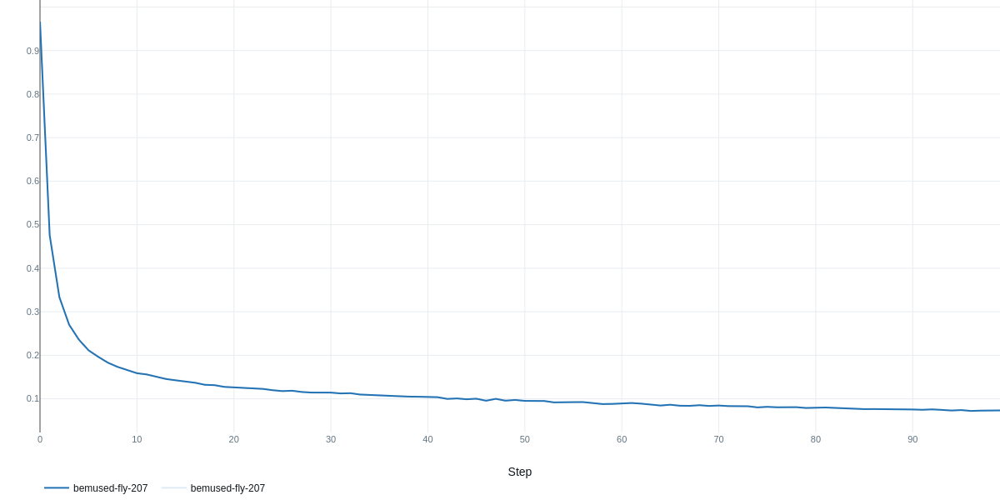
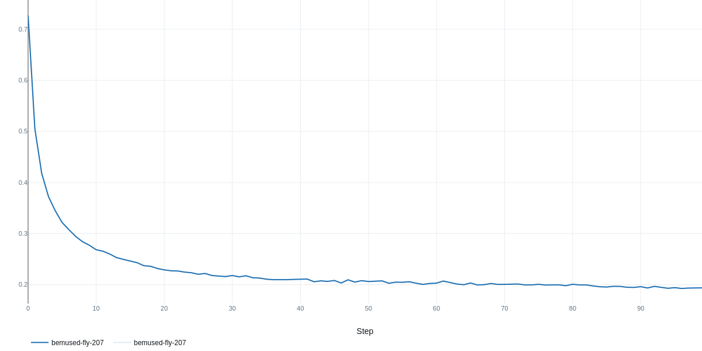
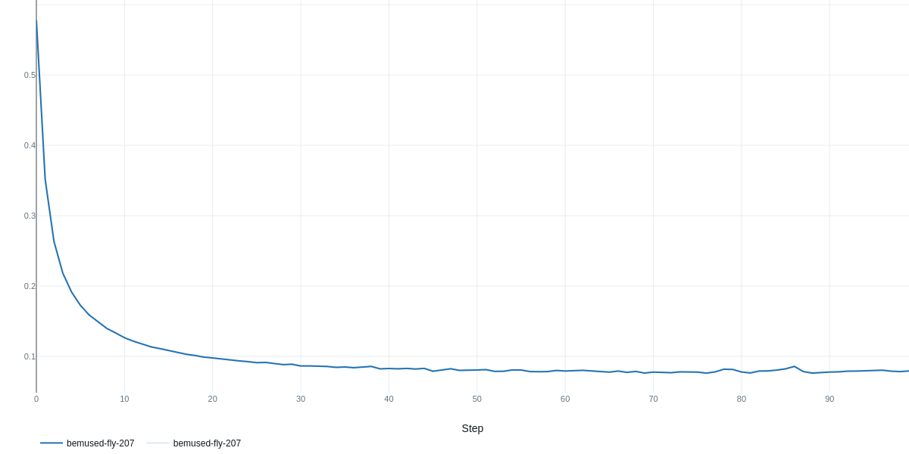
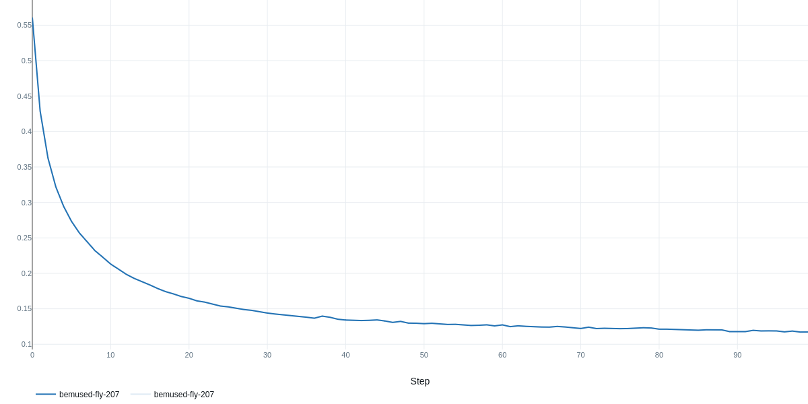
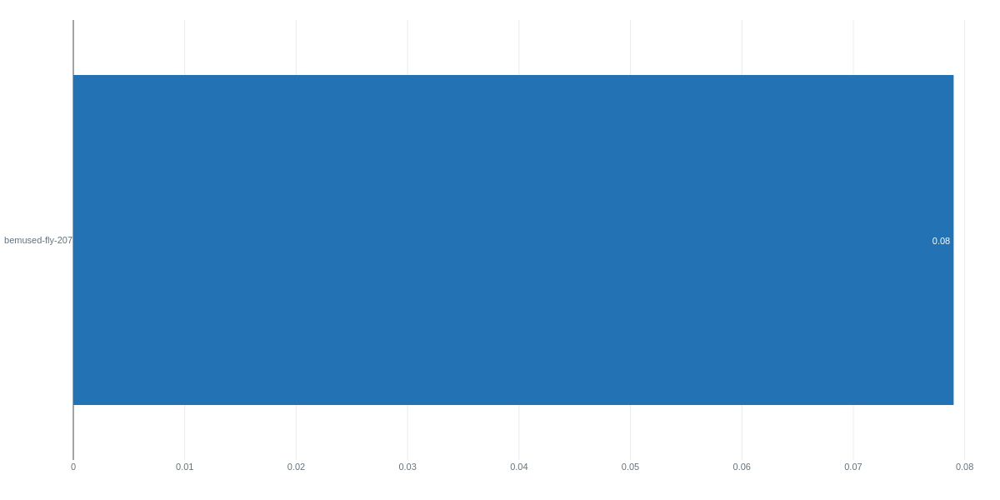
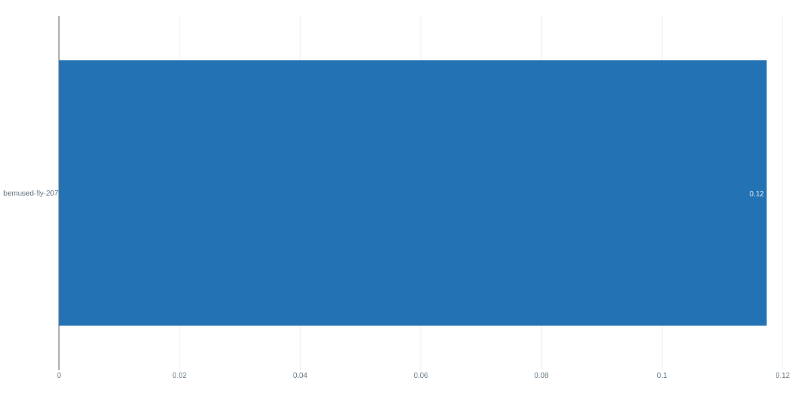

# Gridifix

An end-to-end **Single Bus Fault Detection and Localization Engine** for medium-voltage (MV) power distribution networks. By pairing a custom Deep Neural Network (DNN) for baseline normal state prediction with specialized Random Forests (Yggdrasil Decision Forests), Gridifix isolates real-time grid anomalies and pinpoints single-bus fault locations with extreme precision.

To maximize throughput, the architecture replaces traditional, computationally heavy non-linear Newton-Raphson solvers with a highly optimized, custom **Distribution Linear Power Flow (DLPF)** solver written natively in Python.

The repository includes built-in experiment tracking via **MLflow** to monitor, log, and version pipeline runs, dataset artifacts, and trained models.

---

## Core Architecture & Features

* **High-Speed DLPF Solver:** Native Python implementation of a Distribution Linear Power Flow solver, accelerating voltage-magnitude computations well beyond conventional non-linear Newton-Raphson methods.
* **Hybrid Deep Learning + RF Topology:** * **Keras DNN:** Models standard, non-faulted grid behaviors to predict expected bus voltages, angles, and line power flows.
* **Residual Analytics Engine:** Computes real-time spatial deviations (residuals) between live measurements and neural network baselines to isolate anomalous footprints.
* **Yggdrasil Decision Forests:** Dual-stage classification models that handle instant fault detection and precise single-bus line localization.


* **Automated Data Synthesizer:** Built-in simulation pipeline leveraging `pandapower` to auto-generate comprehensive training profiles (21k+ synthetic healthy and faulted states).
* **Maturity & Experiment MLOps:** Integrated tracking engine using MLflow (`mlflow.db` backend) to record metrics, hyperparameter adjustments, and model weights across training iterations.

---

## Installation & Setup

Configure your runtime environment utilizing Conda to isolate core machine learning and grid simulation binaries.

### 1. Environment Creation

Create a clean Python 3.11 environment:

```bash
conda create -n gridifix_py311 python=3.11 pip -y

```

### 2. Activation

Activate the newly created isolated environment:

```bash
conda activate gridifix_py311

```

### 3. Dependency Installation

Clone the repository, navigate into the root directory, and install the required core packages:

```bash
pip install -r requirements.txt

```

---

## Quick Start

To execute the automated end-to-end data generation, training, and validation pipeline, trigger the primary entry script:

```bash
python src/main.py

```

---

## Experimental Results & Performance

Gridifix leverages **MLflow** for robust experiment tracking and model validation. Below are the training profiles and metric convergence charts extracted from a 100-step execution snapshot (`run: bemused-fly-207`).

### 1. Training & Validation Convergence
Both core loss metrics demonstrate steady convergence with no divergence or overfitting signs, proving the training pipeline's stability over the 21k synthetic samples.

| Training & Validation Loss | Training & Validation MAE |
| :---: | :---: |
| <br>*Training Loss Convergence* | <br>*Training Mean Absolute Error (MAE)* |
| <br>*Validation Loss Convergence* | <br>*Validation Mean Absolute Error (MAE)* |

### 2. Final Evaluation Summary
At step 100, the standalone test-set benchmarks confirm structural precision for spatial residual mapping:

<p align="left">
  
  
</p>

* **Final Validation Loss:** `0.08`
* **Final Validation MAE:** `0.12`

---

## Repository Structure

```text
gridifix/
├── datasets/                 # Simulated and baseline grid topologies
├── docs/assets/              # Architecture diagrams and documentation media
├── mlruns/1/                 # MLflow experiment runs and artifact tracking logs
├── models/                   # Serialized DNN models and Decision Forest weights
├── src/
│   ├── data-synthesis/       # pandapower generation scripts (21k sample pipeline)
│   ├── dlpf-solver/          # Distribution Linear Power Flow solver implementation
│   ├── results/              # Evaluation outputs, metrics, and visualization curves
│   ├── dermodelling.py       # Keras DNN baseline architecture & residual processing
│   └── main.py               # Application orchestration and pipeline entry point
├── .gitignore                # Target build file ignores
├── fault_detection_dataset.csv # Base synthetic dataset file
├── LICENSE                   # MIT License
├── mlflow.db                 # SQLite relational database storage for MLflow runs
├── requirements.txt          # Framework dependencies (Keras, YDF, pandapower, mlflow)
└── README.md                 # System documentation

```

---

## Contributing

Contributions maximizing solver speed, expanding MV topologies, or optimizing the classification layer are highly welcome.

1. Fork the Project
2. Create your Feature Branch (`git checkout -b feature/AmazingFeature`)
3. Commit your Changes (`git commit -m 'Add some AmazingFeature'`)
4. Push to the Branch (`git push origin feature/AmazingFeature`)
5. Open a Pull Request

---

## License

Distributed under the **APACHE 2.0 License**. See `LICENSE` for more information.